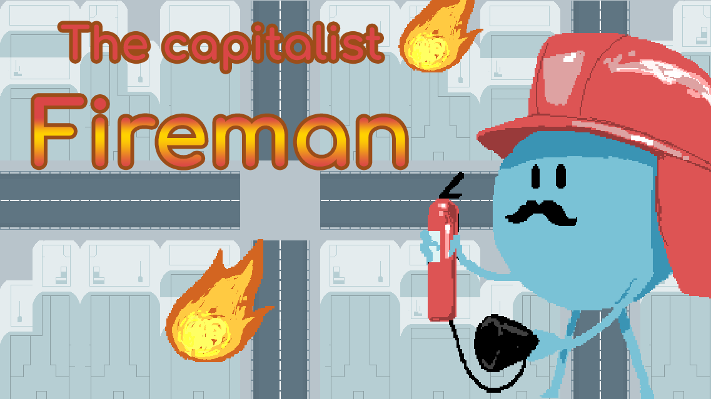
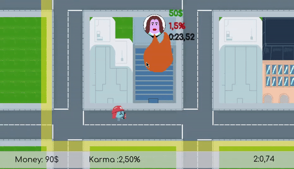
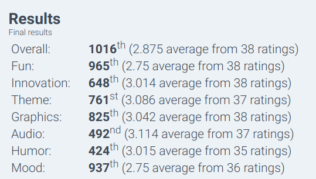

# The capitalist fireman

Omg, the new mayor decided some new budgetary cuts this year for the fire department, if you want to keep your job you will have to prioritize your rescue. Big Donations come from big donors, you will have to save the wealthy first ! But don't overdo it or wage-worker might notice it and you will get fired too. Good luck Hero !

[Try Online](https://guillaume-gomez.github.io/LD44/Build/postMortemLudumDare/)

[LD version](https://guillaume-gomez.github.io/LD44/Build/ludumDare/)

# Dev Process
We decided to make a game where the price of life is competing with the cost of the fire department sustainability. The game rules try to question the player about the duality between efficiency and ethic.

# Controls

| Action | key |
| -------| --- |
| Move | Arrow keys |
| Estinguish| Space |

# Team

| Member | Role |
| ------ | ---- |
| Florian Escuer | Graphics |
| Aurelien Montero | Sound Design |
| Guillaume Gomez | Programming |

# Result

